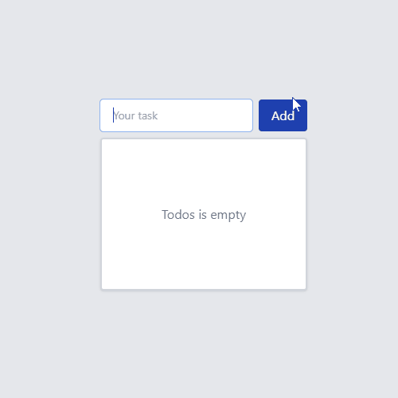

# Simple Todo List | Nuxt.js

By [Can Korkmaz](https://github.com/CanKorkmazim)

## Demo

  
   

## Instructions

1. Clone locally using `git clone git@github.com:CanKorkmazim/nuxt-todo-app.git`
2. Install dependencies using `npm install`
3. Start your server using `npm run dev`
4. Navigate to app in [browser](http://localhost:3000)

## Technologies

This project was installed with the `nuxi@latest init` tool. Tailwind, Sass, NuxtIcon technologies were used.

## Features

This project is a simple Todo List App. Here is the full features list:

- Create a new Todo (press enter on input or click Add button)
- Delete a todo (click on the cross icon)
